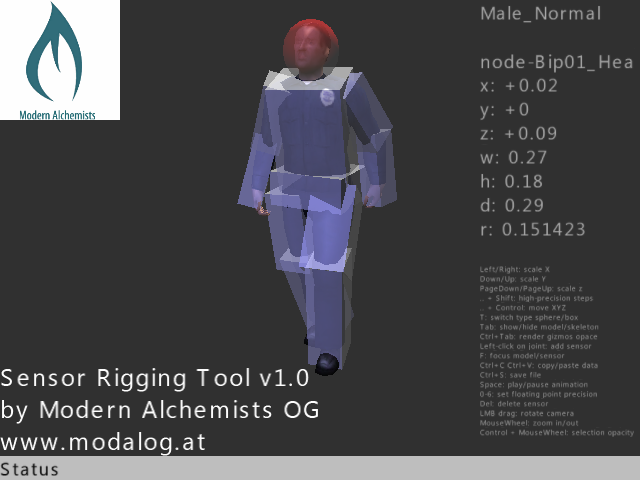

# Modern Alchemists' Sensor Rigging Tool v1.0



*Sensor Rigging* is a Shiva3D tool which enables to add multiple physics sensors to a models skeleton for more precise collision detection (e.g. selecting limbs of a character). Sensors can be moved, scaled and saved to a sensors file.

## Features

*  load multiple models with skeletons and animations
*  add/delete box and sphere sensors
*  move and scale sensors or change sensor types
*  typical orbit camera controls with selection focus
*  copy/paste sensors
*  load and save to file with optional floating point truncation
*  show/hide model and skeleton
*  control opacity of sensors
*  play/pause animations and control animation speed

## Usage

Copy your models, meshes and skeletons in their specific directories. Controls are listed within the application.
In order to load and apply the sensors file in your application you need to copy the sensor loading functions and default sensor models:
*  ```parseSensors()``` function
*  ```addSensor()``` function
*  ```DefaultBoxSensor``` model
*  ```DefaultSphereSensor``` model

## Todo

*  Undo/redo functionality

## License

This application is released under the GNU GPL 3.0 license. Please see the attached LICENSE file for further information.
If you want to use the Sensor Rigging Tool in a non-GPL compliant application please contact us for a commercial license!
